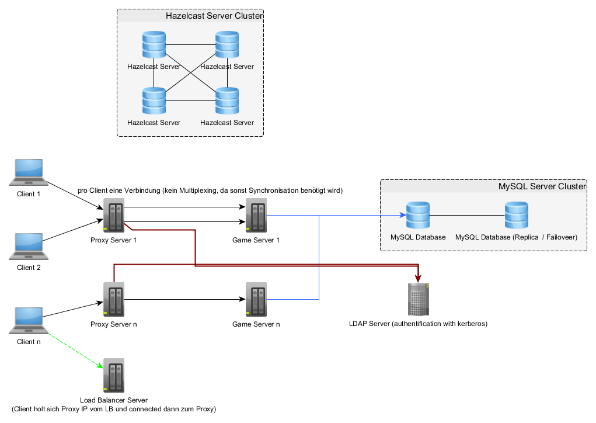

# mmo-proxy-server
A proxy server (tooling) for a mmo game. This is only a tool, not a complete game!

 
 
 
 
 
 
 
 
 

Maps are stored on **FTP Server**.

Proxy Server has to be **transparent**.

## Configuration Management

Proxy Server is auto configured by [Hazelcast](http://hazelcast.org) and [MySQL](https://www.mysql.com/de/)

## Requirements

  - LDAP Server (with kerberos)
  - [MySQL Server](https://www.mysql.com/de/)
  - [Hazelcast Server](http://hazelcast.org)
  - FTP Server (stores maps and map data)

## Network Protocol

  - 1 integer package size (**will be removed from payload data**)
  - 1 byte type
  - 1 byte extendedType (will not be parsed by proxy server
  - 1 short (2 byte) version (protocol version)
  - 1 integer (4 byte) cid (character id) - will be replaced by proxy server automatically
  - payload data (redirected to game servers)

**Type 0x01 is reserved for proxy - sector Server communication**.

### Reserved types

  - 0x01 reserved for proxy - game server communication (client is not allowed to send or receive such messages)
      * 0x01 join message (data: int regionID, int instanceID, float xPos, float yPos, float zPos)
      * 0x02 leave message
      * 0x03 network init message to set cid (character id, proxy --> client)
      * 0x04 joined successfully (gs --> proxy)
      * 0x05 join failed (gs --> proxy)
      * 0x06 internal server error (gs --> proxy)
  - 0x02 authorization (registration, login, create character, character selection and so on)
      * 0x01 login request from client to proxy
      * 0x02 login response from proxy to client
      * 0x03 request list of my characters (only if logged in, client --> proxy)
      * 0x04 list with characters response (only, if logged in, proxy --> client)
      * 0x05 create character request (only, if logged in, client --> proxy)
      * 0x06 create character response (only, if logged in, proxy --> client)
      * 0x07 select character request (only, if logged in, client --> proxy)
      * 0x08 select character response (only, if logged in, proxy --> client)
  - 0x03 movement (if connection failes between proxy - game server, this messages will be dropped)
  - 0x04 update / version (version information, check client compatibility and so on)
  - 0x05 chat
  - 0x06 general client state information (e.q. show loading screen)
      * 0x01 show region loading screen (includes information about region to load, e.q. title, proxy --> client)
  - 0x07 admin stuff (manage worlds, users, npc's and so on)
  - 0x08 admin stuff (reserve)
  - 0x09 game world information (weather, lighing, download tiled map and so on)
  - 0x0A close client connection (region --> proxy)
  - 0x0B error messages & hints
      * 0x01 incompatible client version
      * 0x02 internal server error (no game server found for this sector)
  - 0x0C reserved for client - proxy
      * 0x01 RTT - round trip time (message to determine client ping)
      * 0x02 client requests public key
      * 0x03 proxy sends public key to client

## Modules

  - Core (Config, Login, RSA Encryption, Firewall, ...)
  - Frontend (TCP game frontend)
  - Backend
      * sector server backend
      * login server backend (Registration, Login and so on)
  - Management Module (HTTP Rest Api)
      * list logged in users
      * list frontends with status
      * list available backends with status
  - Database (persistence layer)
  - Main (main configuration)

## Server Architecture

Thanks to [noctarius](https://github.com/noctarius) for his many advices (not every advice is shown in this image)!

## Regions vs. Sectors

Currently server only knows regions.

**Limitations**:

  * Every region is calculated by **one cpu core**!
  * this means every region can hold maximal 100 players!
  * between every region (region change) there will be a loading screen

## Services / Components

There are several Services, e.q. for logging and login.

  - logging
  - login
  - chat (should be also run as standalone version)
  - FTP Server (**to get maps from FTP server**)
  - data storage (mysql)

## Frontends

Proxy Server can have several frontends with different types.

  - TCP game frontend
  - UDP game frontend
  - HTTP/2 management frontend

## Backends

  - several Game Server Backend (redirects messages to game servers, one backend per game server or vert.x backend for event queue)
  
## Dependencie check

## License Check

